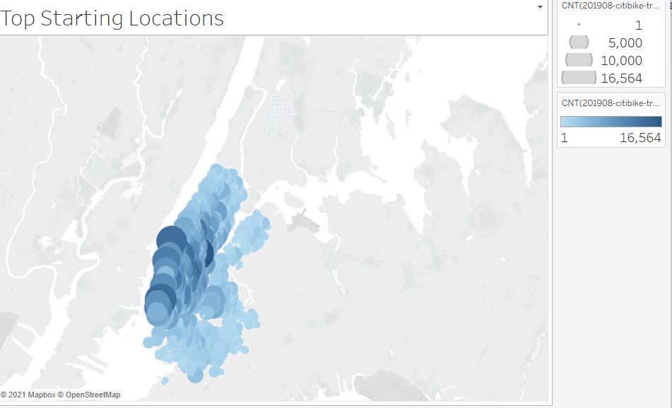
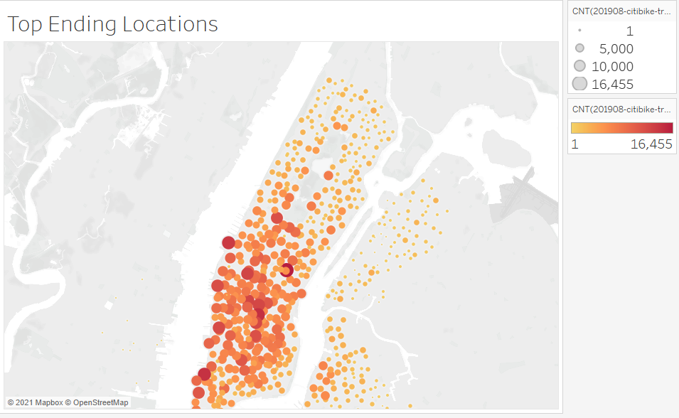
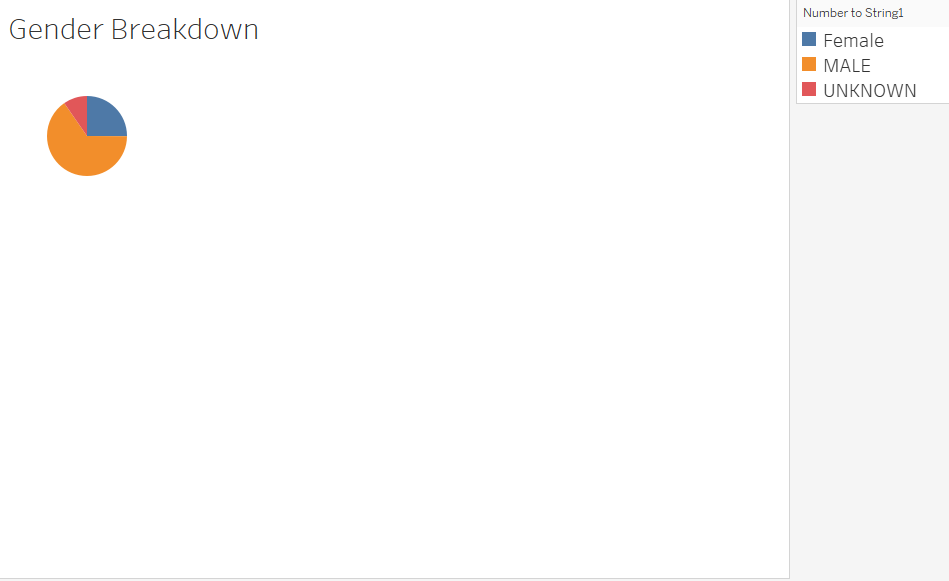
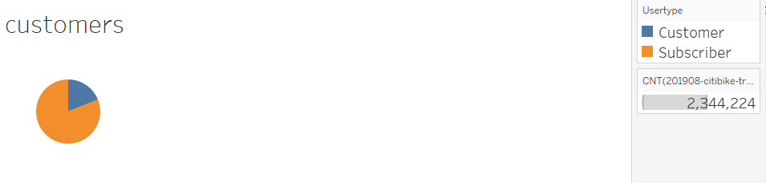

#### NYC CitiBike Analysis

### Overview
Currently providing service in Jersey City, NJ as well as the boroughs of New York City, CitiBike is a public bicycle sharing system. The purpose of this analysis is to learn from the available data on NYC CitiBike use to determine if a similar program would be succesful in Des Moines, Iowa. 

## Results 

CitiBike is used throughout the boroughs, with a significant concentration in Manhattan. 

There has been rapid growth in the NYC/NJ market, CitiBike has more than tripled its number of operating bicycle stations since launching in 2013. 

CitiBike has shown to appeal to both the male and female populations. 

[Link to Tableau Story with visualizations] (https://public.tableau.com/profile/vitaly.bourenin#!/vizhome/Citi_challenge_tableau/Citi_Story?publish=yes)
