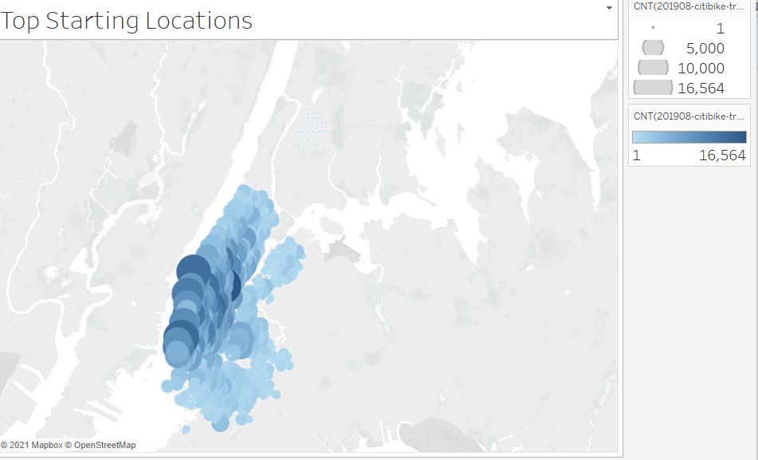
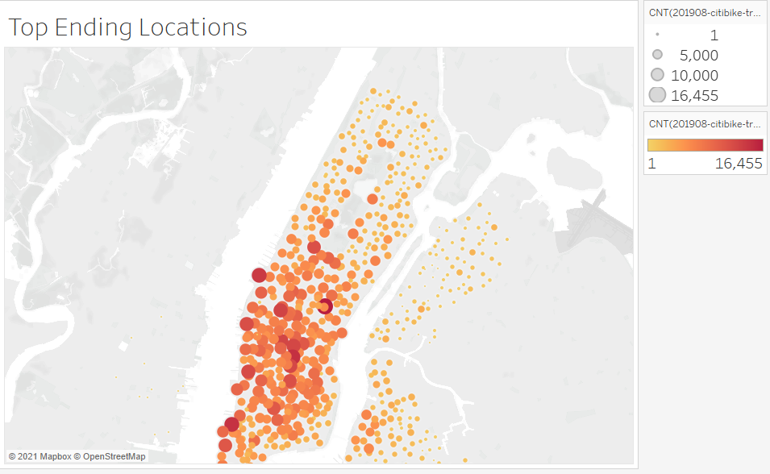
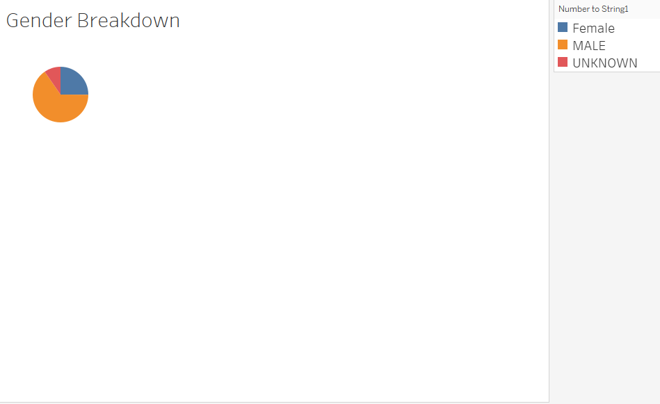
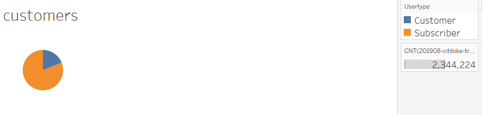

#### NYC CitiBike Analysis

[Link to Tableau Story with visualizations] (https://public.tableau.com/profile/vitaly.bourenin#!/vizhome/Citi_challenge_tableau/Citi_Story?publish=yes)

### Overview
Currently providing service in Jersey City, NJ as well as the boroughs of New York City, CitiBike is a public bicycle sharing system. The purpose of this analysis is to learn from the available data on NYC CitiBike use to determine if a similar program would be succesful in Des Moines, Iowa. 

## Results 

CitiBike is used throughout the boroughs, with a significant concentration in Manhattan. 

There has been rapid growth in the NYC/NJ market, CitiBike has more than tripled its number of operating bicycle stations since launching in 2013. 

CitiBike has shown to appeal to both the male and female populations. 

CitiBike shows promising results in terms of Usertype, with a large number of subscribers, but also a high number of one-off customers that have the potential to be converted to subscribers. 

#Summary
In this analysis we gain many insights into how CitiBike operates and is performing in the NYC/NJ market. In order to determine whether to bring this model to Des Moines, it would be essential to establish which factors of success in the NYC/NJ Market are most important in transitioning the model to the Des Moines market. One cannot make a determination on whether the model would translate well to Des Moines without having established which metrics are most important in determining success. 

Additional visualizations that could improve the analysis include:
1) Income. Survey riders on their annual income and see which economic-classes are using CitiBike. 
2) Determine how customers/subscribers found CitiBike. Survey customers on how they first heard about CitiBike. By understanding how customers are learning about the service, marketing efforts would be greatly benefitted. 
